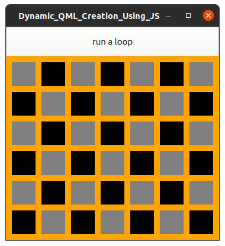

# Dynamic QML creation using Javascript

#### This code is a re-arrangment and modification of the code found @ https://doc.qt.io/qt-5/qtqml-javascript-dynamicobjectcreation.html

# Usage
## Within the code you can....
#### Toggle the comments to explore the two methods in QML Qt.createQMLObject() and Qt.createComponent(). The componentCreation.js will show the asyncronous and syncronous methods of creating QML objects dynamically. Just look at the comments of code for instructions...

## The Application itself...
#### IF lines 12 - 52 is uncommented (active) and lines 61 - 77 commented (inactive) the QML will simply draw 100 squares when the "run a loop" button is clicked. It will add 100 more on each push. Simple, the idea is to highlight an important capability of QML. 

#### IF you are running the opposit commented system QML will utilize code in the componentCreation.js file to dynamically load QML using the Qt.CreateComponent() method. 

# To-do 
#### - Add Delete object code.

# How to use it.... 
#### You Need Qt, it's best to use Qt Creator. Clone the repo and open it in Qt Creator find the Dynamic_QML_Creation_Using_JS.pro file to load the project in Qt Creator. 

 